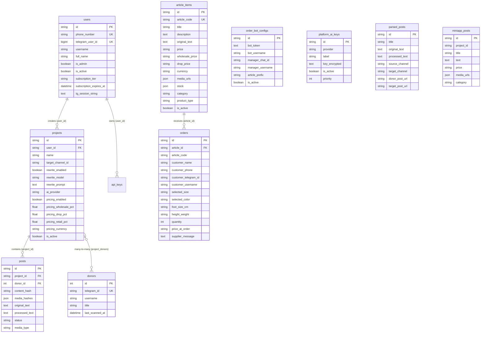

# ПОЛНЫЙ ТЕХНИЧЕСКИЙ АУДИТ КОДОВОЙ БАЗЫ И GAP-АНАЛИЗ
## Переход от текущей монолитной системы к мультитенантной SaaS-платформе ресторанов (уровня StarterApp.ru)

**Дата аудита:** 25 августа 2026 г.  
**Проект:** GhostPost / MyBotAi11  
**Текущий статус:** Production (VPS Ubuntu 22.04, Docker, PostgreSQL 16, FastAPI, React 18)  
**Целевая архитектура:** Мультитенантная SaaS-платформа электронных PWA-меню ресторанов с роутингом `/r/{slug}`, AI-генератором заведений, Super Admin дашбордом и биллингом 3% комиссии с заказов.

---

## СОДЕРЖАНИЕ
1. [Стек технологий, версии и инфраструктура](#1-стек-технологий-версии-и-инфраструктура)
2. [Структура проекта и назначение директорий](#2-структура-проекта-и-назначение-директорий)
3. [Модель данных (Схема БД, таблицы, связи)](#3-модель-данных-схема-бд-таблицы-связи)
4. [Дизайн и темы оформления (Карта хардкода)](#4-дизайн-и-темы-оформления-карта-хардкода)
5. [Меню и каталог товаров (Текущая реализация)](#5-меню-и-каталог-товаров-текущая-реализация)
6. [Заказы, корзина и интеграция с оплатой](#6-заказы-корзина-и-интеграция-с-оплатой)
7. [Панель управления (Админка)](#7-панель-управления-админка)
8. [Аутентификация, авторизация и ролевая модель](#8-аутентификация-авторизация-и-ролевая-модель)
9. [Гэп-анализ: Сравнение с целевой архитектурой SaaS](#9-гэп-анализ-сравнение-с-целевой-архитектурой-saas)
10. [Пошаговый план разработки (Roadmap перехода к SaaS)](#10-пошаговый-план-разработки-roadmap-перехода-к-saas)

---

## 1. Стек технологий, версии и инфраструктура

| Компонент | Технология / Версия | Роль в проекте | Исходные файлы |
| :--- | :--- | :--- | :--- |
| **Backend Framework** | **FastAPI** `0.141.1`, **Uvicorn** `0.52.4`, **Python** `3.12` | REST API, асинхронные эндпоинты, CORS, Dependency Injection | `server.py`, `requirements.txt` |
| **База данных** | **PostgreSQL 16** (Prod) / **SQLite** (`editorial.db`, Dev) | Реляционная БД. В проде развернута в Docker-контейнере `ghostpost_db` | `database/models.py`, `database/session.py` |
| **ORM & Драйверы** | **SQLAlchemy** `2.0.52` (Async Engine), `asyncpg` `0.31.0` (FastAPI), `psycopg2-binary` `2.9.12` (Sync Bot), `aiosqlite` `0.22.1` | Пул соединений (size=30, max_overflow=50), WAL-режим для SQLite | `database/session.py` |
| **Telegram движки** | **Telethon** `1.44.0` (MTProto Client) + **pyTelegramBotAPI** `4.36.1` (Bot API) | Парсинг постов/альбомов через MTProto и бот приёма заказов | `telegram_service/client.py`, `order_bot_handler.py` |
| **AI Модели** | **Google Gemini** (`google-generativeai` `0.8.6`), **OpenRouter REST API**, **Seedance**, **Replicate**, **Luma**, **Runway** | AI-рерайт текстов, Vision-промптинг и генерация промо-видео из фото | `core/ai_rewriter.py`, `core/video_generator.py`, `core/ai_key_manager.py` |
| **Безопасность** | **python-jose** `3.5.0` (JWT HS256), **cryptography** `50.0.0` (Fernet) | Аутентификация через `httpOnly` Cookie (`access_token`), шифрование токенов в БД | `core/auth.py`, `core/crypto.py` |
| **Медиапроцессинг** | **FFmpeg** (системный бинарник), **Pillow** `12.3.0`, **Simhash** `2.1.2`, **ImageHash** `4.3.2` | Монтаж видео Turbo HD, нарезка медиа, дедупликация контента | `core/video_generator.py`, `core/brain.py` |
| **Frontend Framework** | **React** `18.2.0`, **TypeScript** `5.2.2`, **Vite** `5.4.21`, **Tailwind CSS** `3.4.1`, **React Router DOM** `7.18.2`, **Lucide React** `0.344.0` | SPA клиентский интерфейс, дашборд администратора и витрина | `package.json`, `App.tsx`, `vite.config.ts` |
| **Менеджеры пакетов** | `npm` (Node.js 20) для фронтенда, `pip` (Python venv) для бэкенда | Сборка и управление зависимостями | `package.json`, `requirements.txt` |
| **Деплой и хостинг** | **VPS Ubuntu 22.04** (`194.87.52.88`), **Docker Compose** | Multi-stage Dockerfile (Node 20 build + Python 3.12 runtime), 2GB Swapfile | `Dockerfile`, `docker-compose.yml`, `start_all.sh` |

---

## 2. Структура проекта и назначение директорий

```
MyBotAi11-main/
├── core/                       # Ядро серверной бизнес-логики
│   ├── auth.py                 # JWT аутентификация через httpOnly Cookie (get_current_user, get_current_admin)
│   ├── crypto.py               # Fernet симметричное шифрование секретов в БД
│   ├── ai_rewriter.py          # Адаптер вызова Gemini и OpenRouter для рерайта
│   ├── ai_key_manager.py       # Ротация платформенных AI-ключей, лимиты, fallback
│   ├── video_generator.py      # Рендеринг видео: Turbo HD (FFmpeg), Seedance, Replicate, Luma, Runway
│   └── brain.py                # Анализ текста, Simhash дедупликация, редполитика
├── database/                   # Слой базы данных
│   ├── models.py               # 10 SQLAlchemy ORM моделей (User, Project, Post, ArticleItem, Order и др.)
│   └── session.py              # Инициализация Async Engine (asyncpg / aiosqlite), пулы, автомиграции
├── telegram_service/           # Сервисы взаимодействия с Telegram MTProto
│   ├── client.py               # Управление Telethon клиентом, авторизация по номеру/коду
│   ├── listener.py             # Фоновый слушатель новых сообщений из каналов-доноров
│   └── models.py               # Вспомогательные дата-классы сообщений
├── pages/                      # Верхнеуровневые React-страницы и маршруты
│   ├── LandingPage.tsx         # Главный продающий лендинг сервиса GhostPost
│   ├── LoginPage.tsx           # Страница входа (по номеру телефона через Telegram-код)
│   ├── RegisterPage.tsx        # Страница регистрации
│   ├── ConfigPage.tsx          # Настройки AI (токены видеогенерации и выбор текстовой нейросети)
│   ├── EditorPage.tsx          # Редактор постов перед ручной отправкой
│   └── dashboard/              # Внутренние модули панели управления
│       ├── OverviewPage.tsx    # Сводный дашборд со статистикой и быстрыми действиями
│       ├── ParserPage.tsx      # Модуль 1: Парсер каналов новостей и медиа-альбомов
│       ├── ParsedPostsPage.tsx # Модуль 2: Архив и история запарсенных публикаций
│       ├── StorePage.tsx       # Модуль 3: Товарный парсер, наценки (Опт/Дроп/Розница), AI-видео
│       ├── ArticlesPage.tsx    # Модуль 4: Склад товаров, остатки по размерам, заказы и управление ботом
│       └── PromptPage.tsx      # Модуль 5: Редактор и тестирование системных промптов
├── components/                 # Переиспользуемые UI-компоненты
│   ├── Layout.tsx              # Каркас админки (Sidebar, Header, навигация, переключатели)
│   ├── MiniAppShowcaseModal.tsx# Модальное окно предпросмотра витрины Telegram Mini App
│   ├── ProfileModal.tsx        # Модальное окно профиля пользователя и тарифа
│   ├── ActionHistoryPanel.tsx  # Панель логов действий в реальном времени
│   └── IntervalSelector.tsx    # Компонент выбора интервала проверки каналов
├── services/                   # Клиентские TypeScript сервисы
│   ├── apiService.ts           # HTTP-клиент (fetch с credentials: 'include') ко всем роутам FastAPI
│   ├── userConfig.ts           # Хранилище локальных настроек в localStorage
│   ├── taskExecutionService.ts # Синглтон фонового выполнения задач в UI без потери стейта
│   ├── geminiService.ts        # Клиентские вызовы Gemini API
│   └── postProcessor.ts        # Парсинг цен и предобработка текста на клиенте
├── server.py                   # Главный монолитный FastAPI сервер (~2700 строк, 45+ эндпоинтов)
├── order_bot_handler.py        # Автономный процесс Telegram-бота приёма заказов (~850 строк)
├── Dockerfile                  # Multi-stage Dockerfile (Node 20 build + Python 3.12 runtime)
├── docker-compose.yml          # Контейнеризация сервисов (App + PostgreSQL)
└── start_all.sh                # Скрипт запуска: FastAPI (8000) + OrderBot + Frontend Preview (5173)
```

---

## 3. Модель данных (Схема БД, таблицы, связи)

Схема определена в файле `database/models.py`:



### Анализ наличия сущности «Ресторан / Заведение»:
> [!IMPORTANT]
> **Сущность «Ресторан» (Restaurant / Tenant / Venue) в текущей БД отсутствует полностью.**
> 1. Проект создавался под задачи Telegram-клоннера и вещевого склада. Таблица `article_items` содержит поля специфичные для обуви/одежды (`foot_size_cm`, `height_weight`, `wholesale_price`, `drop_price`, `stock`).
> 2. Во всех таблицах **отсутствуют**: `tenant_id`, `slug`, `domain`, `theme_config`, `restaurant_id`, `logo_url`, `cover_url`, `tables_count`, `currency_code`.
> 3. Все товары и заказы хранятся в **общей плоской таблице**, без изоляции между клиентами/заведениями.

---

## 4. Дизайн и темы оформления (Карта хардкода)

В проекте **нет конфигуратора тем или дизайн-токенов**. Стилистика жестко зашита инлайн-стилями (`style={{ ... }}`) и классами Tailwind.

### Точные места зашитого брендинга и цветов:

| Файл | Строки | Захардкоженные параметры |
| :--- | :--- | :--- |
| `components/Layout.tsx` | `88-96` | Название бренда `GhostPost`, подзаголовок `SaaS AI Platform v3.0`, эмодзи логотипа `👻`, градиент `#e63946` -> `#c0392b` |
| `components/Layout.tsx` | `54-56, 72` | Фоновые цвета админки: `#090909`, `#0f0f0f`, шрифт `'Plus Jakarta Sans'` |
| `pages/LandingPage.tsx` | `10-25` | Фиксированные цветовые пятна: красный `#e63946`, оранжевый `#f4a623`, фиолетовый `#7c3aed` |
| `pages/LandingPage.tsx` | `68-85` | Тексты: *«Контент на автопилоте»*, *«Подключи каналы-доноры... GhostPost сам читает»* |
| `pages/LandingPage.tsx` | `510-580` | Тарифная сетка GhostPost: *Free (0 ₽)*, *Starter (1 490 ₽)*, *Pro (3 990 ₽)*, *Business (7 990 ₽)* |
| `pages/dashboard/StorePage.tsx` | `30, 33` | Дефолтные каналы: донор `@somoniyon1998`, таргет `@my_store` |
| `pages/dashboard/StorePage.tsx` | `41-45` | Дефолтные наценки (Опт 10%, Дроп 20%, Розница 30%) |
| `pages/dashboard/ArticlesPage.tsx` | `56-62` | Цвета статусов заказов: `new` (`#3b82f6`), `confirmed` (`#10b981`), `shipped` (`#f4a623`), `cancelled` (`#e63946`) |
| `components/MiniAppShowcaseModal.tsx`| `62, 98` | Ссылка на бота `https://t.me/GhostPostBot/shop` и заголовок `GhostPost Mini App` |
| `order_bot_handler.py` | `147, 272` | Тексты чат-бота: *«Здравствуйте! Хотите оформить заказ...»*, префикс артикула `ART-` |

---

## 5. Меню и каталог товаров (Текущая реализация)

1. **Хранение позиций**:
   - Позиции каталога хранятся в таблице `article_items` (`database/models.py:226-259`).
   - Поля: `title`, `description`, `price`, `wholesale_price`, `drop_price`, `currency`, `media_urls` (JSON), `stock` (JSON-объект: `{"41": 5}` или `{"порция": 10}`), `category`, `product_type`.
2. **Категории**:
   - Отдельной таблицы категорий **нет**. Категория задаётся как простая строка `category: String(100)` в карточке товара.
3. **REST API эндпоинты**:
   - `POST /api/articles` — создание товара (`server.py:1891`)
   - `GET /api/articles` — получение списка всех товаров (`server.py:1943`)
   - `PUT /api/articles/{article_id}/stock` — обновление остатков (`server.py:2098`)
   - `PUT /api/articles/{article_id}/toggle` — скрытие/показ товара (`server.py:2317`)
   - `DELETE /api/articles/{article_id}` — удаление товара (`server.py:2329`)
   - `GET /api/articles/{article_id}/image` — отдача фото товара (`server.py:2263`)
4. **Ресторанная специфика**:
   - Отсутствуют: модификаторы блюд (соусы, добавки, степень прожарки), КБЖУ, граммовки, аллергены, время приготовления, разбивка по типам меню (завтраки, бар, бизнес-ланч).

---

## 6. Заказы, корзина и интеграция с оплатой

### Текущий процесс оформления заказа:
Оформление заказа реализовано **только через Telegram-бота** (`order_bot_handler.py`):
1. Клиент переходит по ссылке `/start ART-0001` в Telegram-бот.
2. Бот достает товар из БД по `article_code`.
3. Бот запрашивает: Размер / Параметры -> Цвет -> ФИО -> Номер телефона.
4. Заказ записывается в таблицу `orders`.
5. Менеджер получает текстовое уведомление в Telegram (`manager_chat_id`).

### Веб-корзина и Оплата:
> [!WARNING]
> 1. **В Web-интерфейсе корзина оформления заказа отсутствует** (есть только экран просмотра поступивших заказов в админке `ArticlesPage.tsx`).
> 2. **Интеграция с онлайн-оплатой отсутствует на 100%** (нет ЮKassa, CloudPayments, Tinkoff, Stripe, Telegram Stars).
> 3. Заказ оформляется исключительно как заявка на созвон с менеджером.

---

## 7. Панель управления (Админка)

В проекте есть SPA-админка React (`pages/dashboard/`):

| Раздел | URL | Функциональность |
| :--- | :--- | :--- |
| **Обзор** | `/dashboard` | Метрики обработанных постов, лог активности, статус сервисов |
| **Парсер ТГ** | `/dashboard/parser` | Выбор донора, целевого канала, запуск копирования постов и альбомов |
| **Запарсенные посты** | `/dashboard/parsed-posts` | Архив публикаций со ссылками на посты донора и свои |
| **Интернет-магазин** | `/dashboard/store` | Мульти-доноры, мульти-таргеты, наценки (Опт/Дроп/Розница), выбор AI-видеогенератора |
| **Склад & Заказы** | `/dashboard/orders` | Просмотр заказов, смена статусов (`confirmed`, `shipped`, `done`, `cancelled`), редактирование остатков товаров (`stock`), настройка токена бота |
| **Промт-инжиниринг** | `/dashboard/prompt` | Редактор и тестирование системных промптов рерайта |
| **Настройки AI** | `/dashboard/settings` | Подключение и проверка токенов нейросетей (Gemini, OpenRouter, Seedance, Replicate, Luma, Runway) |

---

## 8. Аутентификация, авторизация и ролевая модель

1. **Механизм аутентификации**:
   - Реализована в `core/auth.py`.
   - **JWT (HS256)** хранится в **`httpOnly` Cookie** с именем `access_token` (срок — 30 дней). Токен защищен от XSS.
2. **Вход**:
   - По номеру телефона через Telegram MTProto код (`/auth/request_code` -> `/auth/login`).
3. **Роли**:
   - В модели `User` есть булево поле `is_admin: Boolean`.
   - Первый зарегистрированный пользователь автоматически становится `is_admin = True`.
   - Эндпоинты `/api/admin/*` защищены `Depends(get_current_admin)`.
   - **Чего нет**: Полноценной ролевой модели RBAC (Супер-админ платформы, Владелец заведения, Администратор ресторана, Официант/Курьер, Гость).

---

## 9. Гэп-анализ: Сравнение с целевой архитектурой SaaS

| Модуль SaaS платформы | Статус | Текущее состояние в коде | Что необходимо разработать с нуля |
| :--- | :---: | :--- | :--- |
| **1. Мультитенантность (Multi-Tenancy)** | **НЕТ** | Все таблицы плоские. Нет изоляции данных между заведениями. | 1. Модель `tenants` (`id`, `name`, `slug`, `domain`, `theme_config`, `is_active`).<br>2. Внешний ключ `tenant_id` во всех таблицах (`categories`, `dishes`, `orders`, `tables`).<br>3. Клиентский роутинг `/r/:slug` с динамической загрузкой темы заведения.<br>4. Middleware изоляции данных на уровне SQL-запросов. |
| **2. PWA Меню и Web-корзина** | **НЕТ** | Заказ работает только через Telegram-чат. Электронного PWA-меню для гостей нет. | 1. Мобильное PWA-меню для гостя (категории, блюда, состав, КБЖУ, граммовки).<br>2. Модальное окно блюда с модификаторами (соусы, добавки).<br>3. Web-корзина с выбором столика / самовывоза / доставки.<br>4. ServiceWorker + Web Manifest для установки иконки ресторана на экран смартфона. |
| **3. AI Onboarding Генератор ресторана** | **ЧАСТИЧНО** | Есть интеграция с Gemini (`core/ai_rewriter.py`), но настроена на рерайт постов. | 1. Эндпоинт `POST /api/saas/ai-generate-restaurant` (принимает бриф: тип кухни, интерьер, средний чек).<br>2. Генерация JSON: тема оформления, категории, 20-30 блюд с ценами и описаниями.<br>3. Авто-создание тенанта и наполнение меню в БД в 1 клик. |
| **4. Онлайн-оплата и комиссия 3%** | **НЕТ** | Оплата отсутствует. Платформа не монетизирует заказы. | 1. Интеграция эквайринга (ЮKassa / CloudPayments / Тинькофф Бизнес).<br>2. Механизм сплитования платежей: удержание **3% комиссии платформы** и зачисление 97% ресторану.<br>3. Учёт баланса и история транзакций по каждому заведению. |
| **5. Super Admin Dashboard (Панель платформы)** | **НЕТ** | Админка рассчитана на одного пользователя для парсинга Telegram. | 1. Список всех тенантов/ресторанов, статистика активности, блокировка.<br>2. Финансовый дашборд: общий оборот сети (GMV), заработанная комиссия (3%), график выручки.<br>3. Управление тарифами и глобальными настройками платформы. |
| **6. Client Admin (Кабинет ресторана)** | **ЧАСТИЧНО** | Есть управление складом, но в терминах размеров обуви/одежды. | 1. Конструктор меню (категории, блюда, стоп-лист, модификаторы).<br>2. Карта столиков и генератор QR-кодов со ссылками на `/r/{slug}?table=5`.<br>3. Онлайн-экран заказов для кухни со звуковыми оповещениями по WebSocket. |

---

## 10. Пошаговый план разработки (Roadmap перехода к SaaS)

### Фаза 1: Слой данных и Мультитенантность (Бэкенд)
1. Создать новые SQLAlchemy-модели: `Tenant`, `Category`, `Dish`, `ModifierGroup`, `ModifierItem`, `Table`, `Order`, `OrderItem`, `TenantBilling`.
2. Добавить `tenant_id` как обязательный Foreign Key во все сущности.
3. Реализовать Tenant-Middleware в FastAPI (определение тенанта по поддомену, кастомному домену или пути `/r/{slug}`).

### Фаза 2: Клиентское PWA-приложение ресторана (Фронтенд)
1. Разработать гостевой интерфейс `/r/:slug`:
   - Динамическая загрузка дизайн-темы (primary color, logo, cover image, fonts).
   - Каталог категорий и карточки блюд с КБЖУ и фото.
   - Модалка выбора модификаторов блюда.
   - Корзина и оформление заказа (выбор столика из QR-параметра `?table=X`, самовывоз, доставка).
2. Настроить Service Worker и динамический `manifest.json` под каждый ресторан.

### Фаза 3: Эквайринг и Сплитование 3% комиссии
1. Подключить ЮKassa / CloudPayments API для приема платежей картами, СБП и T-Pay.
2. Реализовать сплитование платежей:
   - Сумма заказа: $X$ ₽.
   - Комиссия SaaS (3%): $0.03 \times X$ ₽.
   - Выплата ресторану (97%): $0.97 \times X$ ₽.
3. Вебхуки успешной оплаты и автоматическая смена статуса заказа на кухне.

### Фаза 4: AI-генератор ресторанов из брифа
1. Создать системный промпт для Gemini 2.0 / 1.5 Pro для генерации ресторанного меню в строгом JSON-формате.
2. Создать визард онбординга: пользователь вводит название, кухню и концепт -> AI генерирует готовое заведение с меню и дизайном за 15 секунд.

### Фаза 5: Super Admin & Ресторанная админка
1. Создать **Super Admin Dashboard** (список ресторанов, GMV оборот, начисленная комиссия, аналитика).
2. Обновить **Client Admin** (управление категориями, блюдами, стоп-листом, столиками и экраном заказов).
